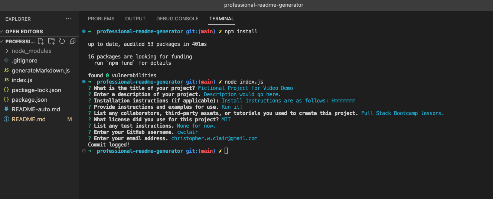
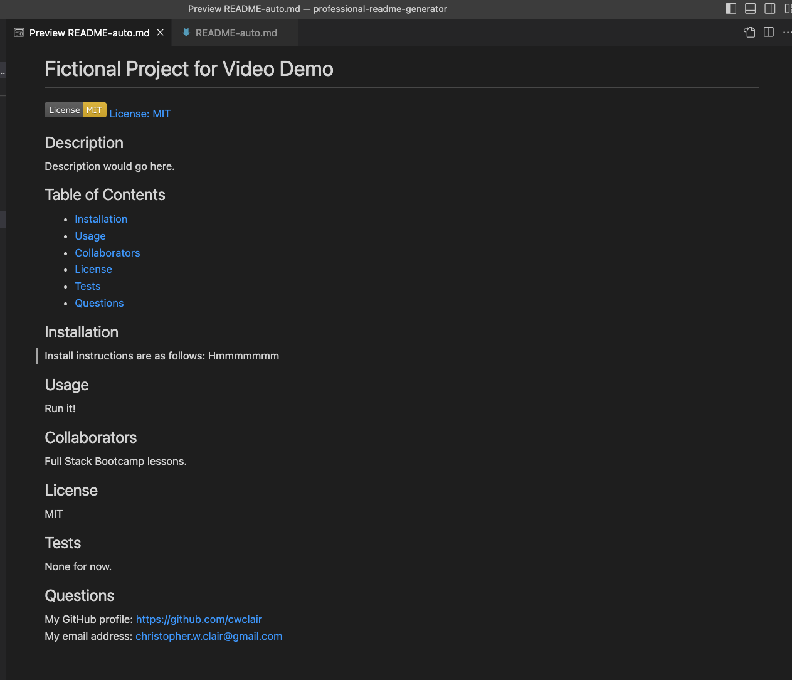

# Professional README Generator
Quickly and easily create a README file by using a command-line application to generate one.

## User Story

```md
AS A developer
I WANT a README generator
SO THAT I can quickly create a professional README for a new project
```

## Acceptance Criteria

```md
GIVEN a command-line application that accepts user input
WHEN I am prompted for information about my application repository
THEN a high-quality, professional README.md is generated with the title of my project and sections entitled Description, Table of Contents, Installation, Usage, License, Contributing, Tests, and Questions
WHEN I enter my project title
THEN this is displayed as the title of the README
WHEN I enter a description, installation instructions, usage information, contribution guidelines, and test instructions
THEN this information is added to the sections of the README entitled Description, Installation, Usage, Contributing, and Tests
WHEN I choose a license for my application from a list of options
THEN a badge for that license is added near the top of the README and a notice is added to the section of the README entitled License that explains which license the application is covered under
WHEN I enter my GitHub username
THEN this is added to the section of the README entitled Questions, with a link to my GitHub profile
WHEN I enter my email address
THEN this is added to the section of the README entitled Questions, with instructions on how to reach me with additional questions
WHEN I click on the links in the Table of Contents
THEN I am taken to the corresponding section of the README
```

## Description of the Work

The application begins when the user types "node index.js" on the command line. The user is greeted with a set of prompts about the project for which the README document is being created. It covers the following topics: project title, project description, installation instructions, usage information, contributions, license (this prompt is followed with a list of options), testing instructions, and contact info (GitHub user name and email address). These questions are posed using the inquirer package. These responses fill in the appropriate spots on the generateMarkdown.js file. In some cases, the responses simply fill in the string literal in the function generateMarkdown or to determine which license badge and license link should be generated.

Once the attributes have been populated with the user input, the generateMarkdown function can be accessed via module export. On index.js, the variable generateMarkdown is set equal to require('./generateMarkdown.js'). Then we write a new file -- in this case, I call it README-auto.md to distinguish the sample README from this very README -- using the populated string literal.

I listed four potential license options, ones that are commonly used, and also included a "none" and an "other" option. In the latter two cases, badge and link are not populated toward the top of the README file. 

## Overview of the Site

I have included a couple of screenshots, and the subsequent section includes a link to a video walkthrough of the application in use.
    
Here is a look at the prompts that the user answers:
    


    
Here is the auto-generated README, showing the input that I used during my demo:
    


## Video Walkthrough

https://drive.google.com/file/d/1U0G_K_pt_hLyaH8mmdXiM8se0dIv7qfG/view

## Link to Deployed Site

https://cwclair.github.io/professional-readme-generator/

## Resources used

Lessons and activities as part of my Full Stack Bootcamp course; markdown code for license badges, found here: https://gist.github.com/lukas-h/2a5d00690736b4c3a7ba. 